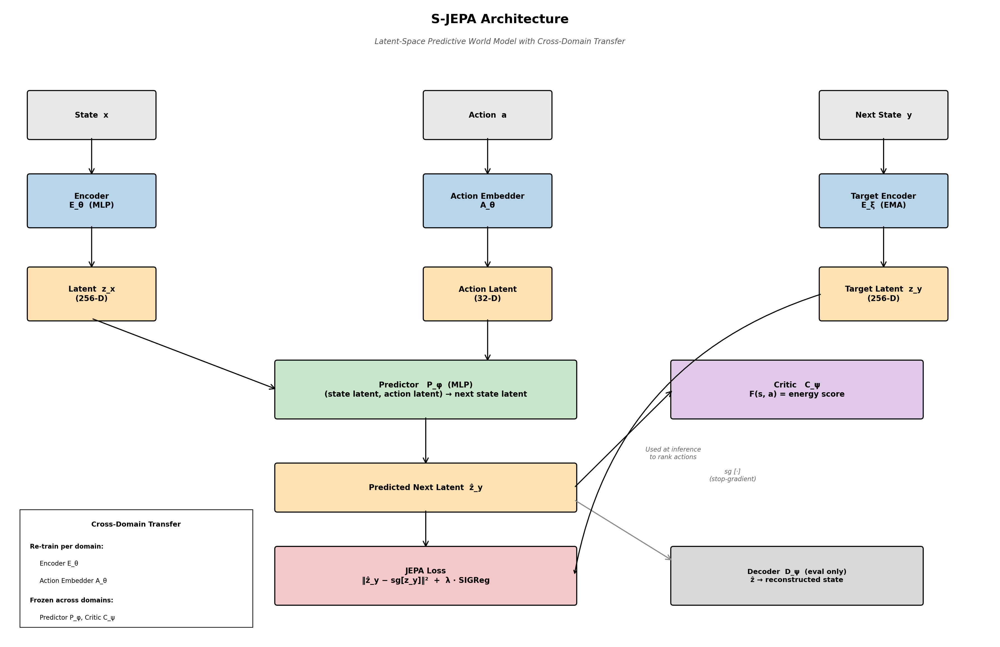

# S-JEPA

**Symbolic Joint Embedding Predictive Architecture**
A world model that adapts to physical domains by separating universal physics dynamics from domain-specific perception.

> Research direction: *AI that adapts to a domain.*
> The bet: a narrow AI that adapts with the user beats fixed general AI on domain-specific physics.

---

## Demo — World Model Playing Angry Birds


https://github.com/user-attachments/assets/adfd817c-1ee7-424a-8436-bd065e77d906

The trained S-JEPA world model selects shots in real time inside Unity Science Birds — encoding the game state, planning in latent space with a multi-start gradient actor, and executing actions through a WebSocket bridge.

---

## Why S-JEPA

LLMs cannot do physics control.

When tested on Angry Birds — frontier models in agentic loops, smaller models adapted to the task — they all collapsed. The same launch angle and power, regardless of state. Bird position, pig position, block configuration — none of it mattered.

Pattern-matching, with zero understanding of the underlying physics.

**This is not a bug. This is what happens when you put physics through an architecture built for language.**

LLMs are statistical. Physics is causal. Their interface is discrete tokens and verbal reasoning — not continuous geometry and gradient-learned dynamics. No amount of scaling fixes this structural mismatch.

S-JEPA is the structural alternative: **freeze the universal, adapt the local.**

---

## Architecture



**Frozen across domains** (universal physics structure)
- **Predictor** `P_φ` — geometric rule for how latents shift under action latents
- **Critic** `C_ψ` — energy scoring used at inference for action selection
- **Latent geometry** — 256D, isotropic Gaussian (enforced by SIGReg)

**Re-trained per domain** (domain-specific perception)
- **Encoder** `E_θ` — raw state → 256D latent
- **Action Embedder** `A_θ` — raw action → 32D action latent

**Training objective:**
```
L = ‖P_φ(E_θ(x), A_θ(a)) − sg[E_ξ(y)]‖²  +  λ · ‖(1/N)SᵀS − (1/d)·I‖²_F
```

**Anti-collapse mechanisms**
- EMA target encoder: `ξ ← 0.98·ξ + 0.02·θ`
- SIGReg: pushes latent covariance toward `(1/d)·I`

---

## Domains

| Domain | State | Action | Physics |
|---|---|---|---|
| **Angry Birds** (Science Birds Unity) | Game state vector | `[angle, power]` | Discrete collisions, projectile motion |
| **PLAID AirfRANS** (CFD) | 5D point cloud (x, y, U_inf, d_surf) | Δ angle of attack | Continuous PDE — Navier-Stokes |
| **PyBullet Grasping** | 32D arm + force state | 7D joint torques | Contact mechanics, friction |

Same architecture, three different physics regimes.

---

## Results

**S-JEPA wins across all three domains.**

**Reconstruction cosine similarity:**

| Domain | Cosine |
|---|---|
| Angry Birds | **0.995** |
| PLAID AirfRANS (CFD) | **0.989** |
| PyBullet Grasping | **0.992** |

**Cross-domain transfer:**
- Reconstruction cosine: **0.997**
- **28% fewer trainable parameters** vs full retrain

**Total model size:** 2.2M parameters — roughly 450× smaller than the 1B LLM baseline that fails on the same task.

---

## Repository Structure

```
.
├── models/                 Core S-JEPA components
│   ├── world_model.py        Encoder + Predictor (GameJEPA, GameDecoder)
│   ├── critic.py             Energy critic
│   └── actor.py              Multi-start gradient actor
├── training/               Training scripts
│   ├── train_jepa.py         Stage 1: Encoder + Predictor
│   ├── train_critic.py       Stage 2: Critic
│   ├── train_decoder.py      Stage 3: Decoder (eval only)
│   ├── train_transfer.py     Cross-domain transfer
│   ├── retrain_improved.py   Full retraining pipeline
│   └── finetune_*.py         LLM baseline fine-tuning
├── evaluation/             Metrics, robustness tests, baseline evals
│   ├── evaluate.py
│   ├── robustness_test.py
│   ├── eval_baselines_plaid.py
│   └── eval_baselines_sim.py
├── domains/                Domain modules (grasping)
├── plaid/                  CFD AirfRANS pipeline
├── science_birds/          Unity game client
├── llm_baseline/           LLM baseline scripts
├── scripts/                Run / play / ablation entry points
│   ├── play_live.py          Run the world model live in Unity
│   ├── play_llm_*.py         Run frontier-LLM baselines
│   ├── play_finetuned_*.py   Run fine-tuned LLM baselines
│   ├── run_ablations.py
│   ├── run_ablations_live.py
│   └── retrain_no_sigreg.py
├── tests/                  Integration tests
├── results/                JSON result dumps
├── docs/                   Paper draft, proposal, generators
│   ├── sjepa_paper.tex
│   ├── lossfunk_proposal.pdf
│   └── sjepa_architecture_clean.py
├── assets/                 Architecture diagram and figures
├── configs/                Run configs
├── requirements.txt
└── README.md
```

---

## Getting Started

### Install
```bash
git clone https://github.com/ishaanv1709/S-JEPA.git
cd S-JEPA
pip install -r requirements.txt
```

### Run the world model live in Angry Birds
1. Open Unity Hub and add the Science Birds project
2. Press **Play** in Unity (starts WebSocket server at `ws://localhost:9000`)
3. Run:
   ```bash
   python scripts/play_live.py
   ```

### Run the LLM baselines
```bash
python scripts/play_llm_base.py            # generic frontier-LLM loop
python scripts/play_finetuned_base.py      # fine-tuned LLM
```

### Train from scratch
```bash
python training/train_jepa.py      # Stage 1
python training/train_critic.py    # Stage 2
python training/train_decoder.py   # Stage 3 (eval only)
```

### Cross-domain transfer
```bash
python training/train_transfer.py  # freeze predictor + critic, retrain encoders
```

### Ablations
```bash
python scripts/run_ablations.py
python scripts/run_ablations_live.py
```

---

## Why the Predictor Is Frozen — The Chess Coach Analogy

A chess coach watches players move pieces and predicts the next move. The coach doesn't care if you're playing on a wooden board, a digital board, or a 3D hologram. The coach only sees the abstract chess position.

The board (the encoder) translates the physical setup into the abstract chess representation. The coach (the predictor) operates on that abstraction.

If you switch from wooden boards to digital boards, **you don't retrain the coach.** You give the coach the same abstract chess positions — just generated differently.

The S-JEPA predictor learned a geometric rule:
> *When this kind of latent receives this kind of action latent, it shifts to that kind of latent.*

This is a geometric rule in latent space, not a physical rule. Same rule whether the latent represents Angry Birds blocks, CFD pressure fields, or gripper joint angles.

**The encoder does the domain-specific translation. The predictor applies the same geometric rule, unchanged.**

---

## Connection to "AI That Adapts to a Domain"

| Open question | S-JEPA's answer |
|---|---|
| What is "understanding" a domain? | Causal geometry in latent space, measured by Spearman ρ between critic energy and ground-truth quality. |
| What stays in weights vs assembled at inference? | Universal dynamics in frozen weights; domain-specific perception in adapter modules. |
| How to prevent catastrophic forgetting? | Parameter isolation by architectural design — frozen weights cannot drift. |
| Parametric vs non-parametric? | Parametric core + non-parametric extensions for edge cases (retrieval, calibration). |
| Learning in constrained compute? | ~500K trainable parameters per new domain; laptop-GPU scale. |

---

## Future Work

- **T-JEPA** — Topological JEPA using persistent homology (Betti numbers) for cardinality-invariant scenes (variable object counts, particle systems, granular media).
- **Online adaptation** — Streaming encoder updates without offline retraining.
- **Hierarchical predictors** — Multi-timescale dynamics for long-horizon planning.
- **LLM-JEPA hybrids** — Language-conditioned world models grounding semantic goals in physics latent space.

---

## Acknowledgements

Built on the foundations of LeCun et al.'s JEPA framework and LeWorldModel. PLAID AirfRANS dataset by the AirfRANS authors. Science Birds Unity by the AIBIRDS competition.
